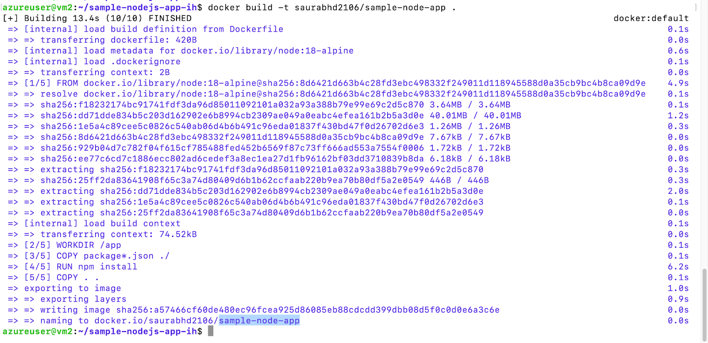

# Lab 2 - Containerizing a Node.js Application with Docker

In this lab, you will learn how to containerize a standalone Node.js application using Docker.&#x20;

By the end, you’ll have your Node.js app running inside a Docker container, which makes it portable, consistent across different environments, and easy to manage.

### Pre-requisite

1. A virtual machine with docker installed
2. An account on Dockerhub (You can create for free on https://hub.docker.com)

### Learning Objectives

* Learn what it means to containerize an application and the benefits (e.g. portability and consistent environments).
* Create a Dockerfile (a text file with instructions to build a Docker image) that defines how to containerize your Node.js application.
* Use Docker CLI commands to build an image from the Dockerfile.&#x20;
* Launch a container from the image, mapping the app’s port to your host so that you can access the app via a web browser or curl.
* Access the application through the exposed port to ensure it’s running correctly inside the container.

### Steps to follow&#x20;

Follow the steps below to containerize your Node.js application.

Clone the code repository from here - [Sample Node Application](https://github.com/saurabhd2106/sample-nodejs-app-ih.git)

#### Step 1: Write a Dockerfile for the Node.js App

First, in the root directory of your Node.js project (where your app.js and package.json reside), create a new file named Dockerfile (no file extension).&#x20;

This file will define how to build a Docker image for your app. Open the Dockerfile in a text editor and add the following content:

```
# Use an official Node.js runtime as the base image
FROM node:18-alpine

# Set the working directory in the container
WORKDIR /app

# Copy package files and install dependencies
COPY package*.json ./
RUN npm install

# Copy the rest of the application code
COPY . .

# Expose the port that the app runs on
EXPOSE 3000

# Define the command to run the app
CMD ["node", "server.js"]
```

Let’s break down what each instruction in this Dockerfile does:

`FROM node:18-alpine` – Specifies the base image (the official Node.js image on Alpine Linux) for your container. This means your container will use Node.js 18 in a lightweight Alpine Linux environment.

`WORKDIR /app` – Sets the working directory inside the container to /app. All subsequent commands (like copy and install) will operate in this directory.

`COPY package*.json ./` – Copies your app’s dependency files (both package.json and package-lock.json, if present) into the container’s working directory.

`RUN npm install` – Installs the dependencies inside the container. This runs npm install so that all required Node modules are added to the image.&#x20;

`COPY . .` – Copies the rest of your application code into the container (everything in the current directory to the working directory). This includes your server.js and any other source files.

`EXPOSE 3000` – Documents that the container listens on port 3000. (This doesn’t publish the port by itself, but serves as documentation and can be used by tools to automatically map the port.)

`CMD ["node", "server.js"]` – Specifies the command to run when the container starts. Here it will start the Node.js application by running node server.js. (Ensure that server.js is the entry point of your app.&#x20;

If your app uses a different start script, adjust this command accordingly, for example CMD \["npm", "start"] if you have a start script in package.json.)

#### Step 2: Build the Docker Image

Next, build the Docker image from the Dockerfile.&#x20;

Open a terminal (or command prompt) in the project directory (where the Dockerfile is located) and run the following command:

```
docker build -t <dockerhub_username>/sample-node-app .
```

Here, -t sample-node-app tags the image with the name “sample-node-app” (you can choose any name you like for the image), \<dockerhub\_username> is your username account of Dockerhub and the final . represents the build context (the current directory, which Docker will scan for the Dockerfile and the app files).&#x20;

NOTE - You can create a new account on dockerhub here - [https://hub.docker.com/](https://hub.docker.com/)

<figure><figcaption></figcaption></figure>

Docker will read the instructions in your Dockerfile and assemble the image step by step

#### Step 3: Run the Docker Container

Now that you have an image, run a container using that image. Execute the following command:

```
docker run -d -p 80:3000 <dockerhub_username>/sample-node-app
```

This tells Docker to create a new container from the sample-node-app image and run it. The -p 80:3000 option publishes the container’s port 3000 to port 80 on your host machine (in format host\_port:container\_port).&#x20;

In other words, it maps the Node.js app’s port inside the container to your computer’s port, so that you can access the app via http://\<public\_ip\_address>:80 on your machine.

-d is the detached mode,&#x20;

When you run this command, the Node.js application starts inside the container.&#x20;

#### Step 4: Verify the Application is Running in the Container

Finally, confirm that your app is up and reachable. Open a web browser and navigate to http://\<public\_ip\_address>:3000 (on the same machine where Docker is running).

<figure><figcaption></figcaption></figure>

Note - If you are using a Azure Linux VM then access the application via&#x20;

```
http://<public_ip_address>:3000
```

You can use curl from inside the virtual machine:

```
curl -I http://localhost:3000
```

<figure><figcaption></figcaption></figure>

At this point, you have successfully containerized your Node.js application. The Node app is running inside a Docker container, and you accessed it via the host’s browser or curl, proving that the port mapping worked.&#x20;

#### Step 5: Push the docker image to Dockerhub

You can push this image to the Dockerhub registry to distribute it to other developers.

1. Login to Dockerhub through your browser. Navigate to [https://hub.docker.com](https://hub.docker.com). Click Sign In
2. Enter email address and password and click continue.
3. Next, click the user icon on the top right corner.
4. Click Account Settings
5. Next, select the Personal access token link&#x20;
6. Click Generate new token
7. Enter the name of the token say, learn-docker
8. Click Generate
9. Copy the token, and save it somewhere safe. You won’t get this screen again.
10. Next, switch to the terminal and execute the following command.

```
docker login
```

11. Enter the username and the personal access token.
12. Once logged in. Execute the following command.

```
docker push <dockerhub_username>/sample-node-app
```

Congratulations on completing this lab, where we learnt how to containerise a web application!
